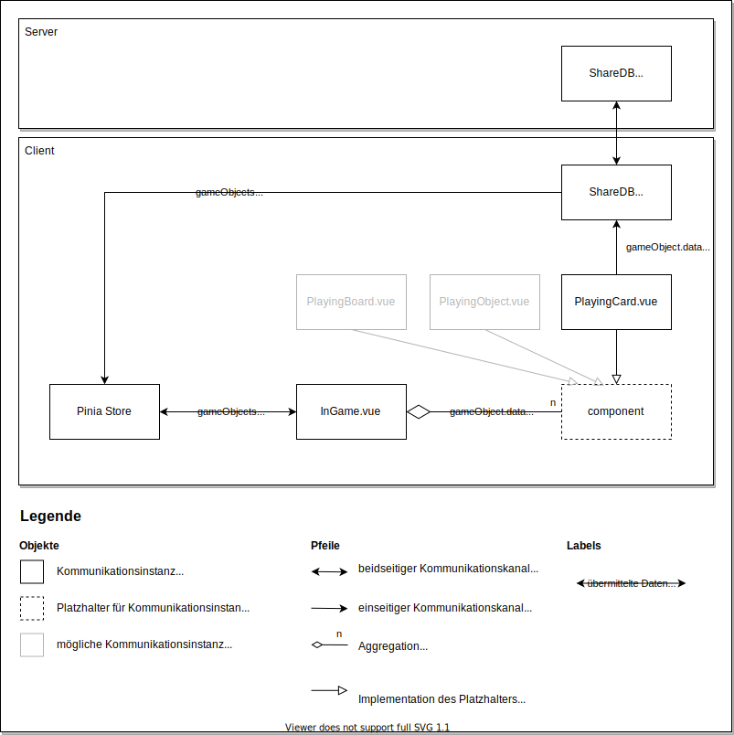

# Design

## Erläuterung
Dieses Dokument beschreibt die Umsetzung einiger Systembestandteile.

## Synchronisation
<!-- TODO: Erläuterung wie Synchronisation grob systemweit funktioniert (Server, Client) -->

### Synchronisation von Spielobjekten
<!-- TODO: Einleitende Worte -->

Das hier dargestellte Diagramm soll den Kommunikationsablauf für die Synchronisation von Spielobjekten, am Beispiel der Spielkarte (PlayingCard.vue), verdeutlichen.

Alle Objekte im Client beschreiben die lokale Synchronisation eines Spielobjekts innerhalb der Vue-Anwendung. Der Server synchronisiert über ShareDB alle lokalen Änderungen. Somit wird jede Änderung an einem Spielobjekt zwischen allen Clients synchronisiert.

