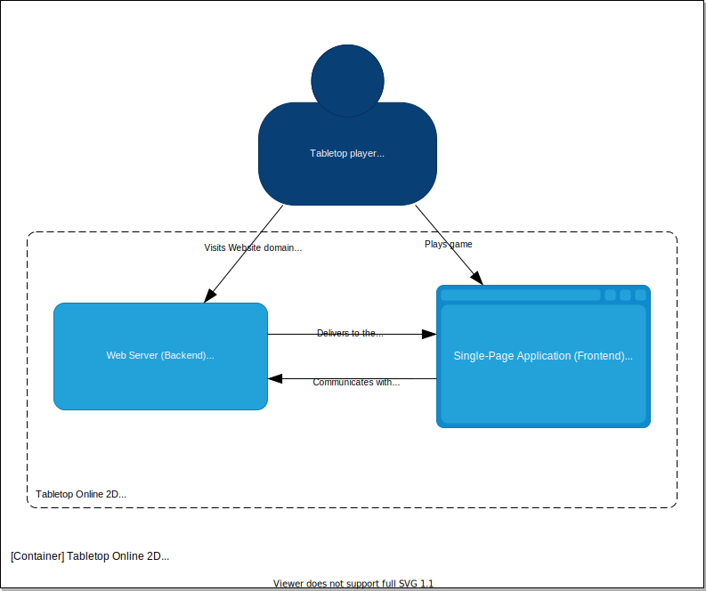

# Design

## Erläuterung
Dieses Dokument beschreibt die Umsetzung einiger Systembestandteile.

## Architektur
Die Anwendung ist nach einem klassischem Server-Client-Modell aufgebaut. Wenn sich ein Spieler auf die Domain des Webservers verbindet, stellt der Server dem Nutzer einen Client als Single-Page Application (Frontend) bereit.

> C4-Model (Level 2) - zeigt den groben Aufbau des Systems

### Client
Im Client wird für den Spieler ein Spielfeld angezeigt, worauf sich Spielobjekte und ein Spielbrett platzieren lassen. Über eine Sidebar kann der Spieler u.a. sein Spielerprofil ändern, alle Mitspieler einsehen und Spielobjekte spawnen. Ein Logbuch zeigt zudem die Ereignisse der aktuellen Spielsession an.

Der Client zeigt alle erstellten *Playing Objects* über einen *Tabletop Renderer* an. Die zu erstellenden Spielfiguren entnimmt der Renderer dem reaktiven *Tabletop Store*, in dem alle zu synchronisierenden Daten enthalten sind. Alle lokalen Informationen, die nicht synchronisiert werden müssen, werden im *Session Store* gehalten. Über das *User Interface* interagiert der Nutzer mit den reaktiven Daten aus den Stores. Die Synchronisationsaufgaben werden geteilt in *State Sync* und *Realtime Sync*.

### Server
Der Server ist für die Verbindung der Clients und für das Überprüfen und Weiterleiten von Synchronisationsaufgaben verantwortlich. Er agiert als Mittelsmann zwischen den Clients.

Der Server stellt initial ein geteiltes Dokument über den *State Sync Server* zur Verfügung und überprüft die Bewegung der Spielobjekte im *Realtime Sync Server* auf Integrität.

> C4-Model (Level 3) - Aufbau von Backend und Frontend

## Synchronisation
Damit ein Brettspiel über mehrere Clients geteilt werden kann, ist es notwendig, lokale Änderungen am Spiel zu synchronisieren. Synchronisiert werden müssen u.a. die Spielobjekte, das Spielbrett, Informationen über Mitspieler und das Logbuch. Da neu hinzukommende Spieler zu einer bestehenden Session den bisherigen Spielstand empfangen wollen, besteht zusätzlich der Anspruch an die Synchronisation, den Spielstand auf dem Server zu halten.

Das Speichern und Synchronisieren des Spielstands wird über den *State Sync Server* geregelt. Hierbei wird ein Dokument im JSON0-Format erstellt und über ShareDB allen Clients zum Lesen und Schreiben zur Verfügung gestellt.

Für die Synchronisation von Bewegungen der Spielobjekte ist ShareDB zu langsam. Es ist außerdem nicht notwendig jede einzelne Bewegung zwischen Aufheben und Ablegen eines Spielobjekts als einen neuen Spielstand zu speichern. Um die Bewegung dennoch in Echtzeit übermitteln zu können, wird ein *Realtime Sync Server* eingesetzt. Dieser Server nutzt Socket.io für die reine Weiterleitung von Bewegungsupdates.

Somit ist ein flüssiges und reaktives Spielerlebnis gegeben, zu dem neue Spieler zu jeder Zeit dazukommen können.

### Synchronisation von Spielobjekten
Um die Bewegung der Spielobjekte in Echtzeit synchronisieren zu können und gleichzeitig zu verhindern, dass andere Mitspieler ein sich bewegendes Spielobjekt ebenfalls bewegen können, sind mehrere Überprüfungen notwendig.

Sobald ein Spielobjekt angeklickt wird und versucht wird zu bewegen, fragt der *Realtime Sync Client (RSC)* den *Realtime Sync Server (RSS)* an, ob dieses Spielobjekt bereits von einem anderen Spieler bewegt wird. Ist das der Fall, dann verneint der *RSS* die Anfrage und der *RSC* blockiert die Bewegung. Wird das Spielobjekt noch nicht bewegt, dann wird die Bewegung zugelassen und an die *RSC*s aller Clients weitergeben, um dort jeweils die Position des entsprechenden Spielobjekts auf dem Spielfeld zu ändern. Außerdem informiert der *RSS* den *State Sync Server (SSS)*, das Spielobjekt für alle anderen Spieler zu sperren. Der *SSS* leitet diese Information an alle *State Sync Clients (SSC)* weiter, damit diese das Sperren des Objekts bei den Clients lokal durchsetzen. Das Spielobjekt, welches der Spieler direkt bewegt, wird natürlich nicht gesperrt.

Nachdem die Bewegung nun registriert wurde, wird jedes weitere Bewegungsupdate des Spielobjekts über den *RSS* an alle anderen *RSC* in Echtzeit weitergeleitet.

Lässt der Spieler das Spielobjekt los, wird der *SSS* informiert die letzte Position und das Entsperren des Objekts ans alle Mitspieler weiterzuleiten. Diese Information bekommen die anderen Clients im *SSC* und das Objekt wird lokal bei jedem Spieler wieder entsperrt.

> Sequenzdiagramm - Vorgänge beim Bewegen eines Spielobjekts